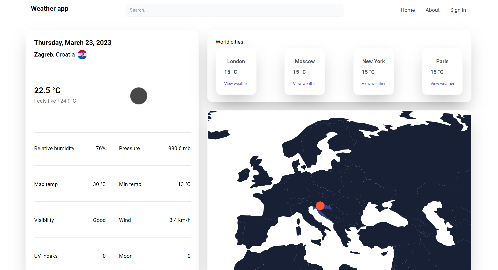

# Weather App (In Development)

## Introduction

The Weather App is an ongoing web application project that aims to provide users with the ability to check the current weather conditions and 5-day forecasts for a specific city. The app fetches weather data from the "Open Meteo" API to provide accurate and up-to-date information. Users can also view a map showing the location of the selected city.

## Features

- **City Weather**: Users can input a city name in the search bar and view the current weather conditions for that city. The app will also display a 5-day forecast with detailed weather information for each day.

- **Weather Icons**: The app integrates a weather icon library to represent the weather conditions visually. Users can see appropriate weather icons, such as a sun for sunny days, a cloud for cloudy days, etc., for each day's forecast.

- **Geolocation**: The app automatically detects the user's current location and displays the weather for that location by default. Users can also manually input a different city to view its weather.

- **Map View**: The app provides a map view that shows the location of the selected city. This feature helps users visualize the geographical location of the city they are interested in.

- **About Page**: The app includes an About page that provides information about the project, its purpose, and the technologies used.

## Technologies Used

The Weather App is built using the following technologies:

- React A JavaScript library for building user interfaces.
- React Router: A library for handling routing in the React application.
- Redux: A state management library for managing application state.
- TypeScript: A superset of JavaScript that adds static typing to the language.
- Tailwind CSS: A utility-first CSS framework for creating responsive and customizable designs.
- Open Meteo API: An external API used to fetch weather data.

## Learning Opportunities

By building this Weather App, you will have an opportunity to learn and gain experience in the following:

- React: Understand the fundamentals of React and how to create components and manage state in a React application.

- React Router: Learn how to handle routing and navigation within a React app, allowing users to navigate between different pages.

- Redux: Get hands-on experience with state management using Redux, allowing for a more organized and scalable application.

- TypeScript: Gain familiarity with TypeScript, its benefits, and how to use static typing for more robust code.

- Tailwind CSS: Explore Tailwind CSS and its utility classes to create responsive and visually appealing designs with ease.

- Integrating External APIs: Learn how to fetch data from external APIs and integrate it into your application.

- Geolocation: Implement geolocation features to automatically detect and display the user's current location.

## Getting Started

To get started with the Weather App project, follow these steps:

1. Clone the repository from GitHub.

2. Set up your development environment with Node.js and npm.

3. Install the required dependencies using `npm install`.

4. Obtain an API key from "Open Meteo" to access their weather data.

5. Start building the app, implementing features like search, weather display, weather icons, geolocation, and map view.

6. Use Redux to manage the app's state and ensure a smooth user experience.

7. Utilize TypeScript to add type safety to your code and prevent common errors.

8. Apply Tailwind CSS classes to create a modern and responsive user interface.

9. Create an About page to provide information about the project and the technologies used.

10. Test your app thoroughly and make any necessary improvements or optimizations.

## Conclusion

The Weather App project is an exciting endeavor that will provide you with valuable experience and skills in front-end development. Keep in mind that this app is currently in development, so there might be updates and improvements as the project progresses. Enjoy the learning journey and have fun building your Weather App!
