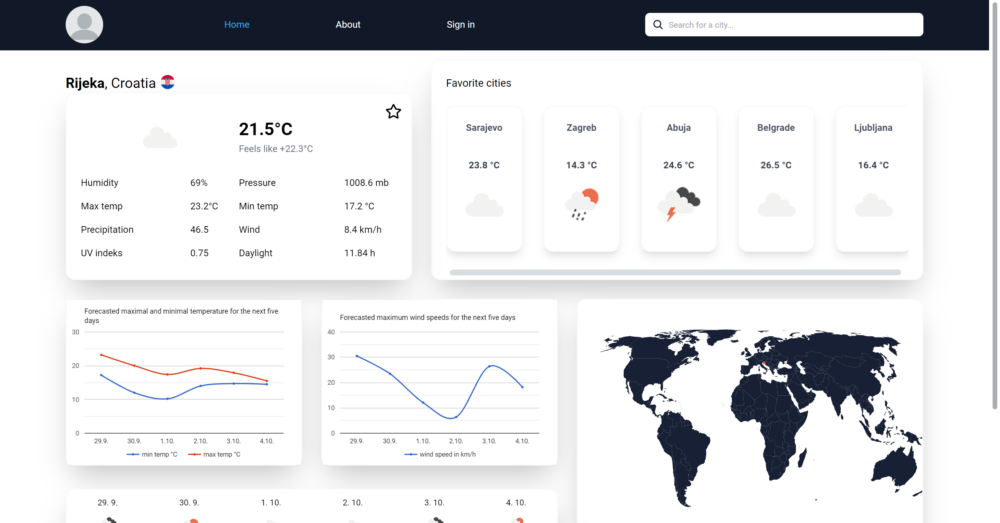

# Weather App (In Development)

## Introduction

The **Weather App** is an ongoing web application project designed to provide users with up-to-date weather information and forecasts for any city worldwide. Leveraging the **Open Meteo API**, the app ensures accurate weather data and offers an interactive map to visualize the city’s location. Whether you're planning your day or a week ahead, this app has you covered with current conditions and a 5-day forecast.

Explore the live version of the app [here](https://weather-app-goran.netlify.app/).

## Features

- **City Weather Search**: Users can input any city in the search bar to view real-time weather details, including temperature, humidity, wind speed, and more. Along with this, the app displays a 5-day weather forecast, offering daily insights on temperature, wind, and precipitation.

- **Dynamic Weather Icons**: Visually intuitive weather icons enhance the user experience. Whether it's sunny, rainy, or cloudy, users can instantly identify the weather conditions thanks to appropriate icons, making the data easily interpretable at a glance.

- **Geolocation Support**: The app can automatically detect the user’s current location and display local weather conditions by default. However, users can manually search for weather data in other cities as well.

- **Interactive Map View**: For every city searched, the app includes an interactive map showing the geographical location of the selected city. This feature helps users get a spatial understanding of the area.

- **About Page**: The app features an informative "About" page where users can learn more about the project, its goals, and the technology stack used to build it.

## Technologies Used

The Weather App is built using modern web development technologies:

- **React**: A popular JavaScript library for building user interfaces and components efficiently.
- **React Router**: Facilitates seamless navigation and routing between different pages of the application.
- **Redux**: Manages application state, making the app more scalable and maintainable.
- **TypeScript**: Introduces static typing to JavaScript, improving code quality, maintainability, and developer experience.
- **Tailwind CSS**: A utility-first CSS framework that simplifies responsive design and styling.
- **Open Meteo API**: Provides real-time weather data, ensuring accurate and reliable information for users.

## Key Learning Opportunities

Building the Weather App provides an immersive learning experience, touching on key concepts in modern front-end development:

- **React**: Understand the principles of component-based design and state management in React.
- **React Router**: Learn to manage page routing in a single-page application (SPA) and enhance user navigation.
- **Redux**: Gain experience in centralized state management with Redux, and understand how to maintain data consistency across components.
- **TypeScript**: Explore the benefits of using TypeScript for catching errors early and improving developer productivity.
- **Tailwind CSS**: Leverage Tailwind's utility-first approach to quickly style elements and build responsive, user-friendly designs.
- **API Integration**: Learn how to fetch and use external data, ensuring smooth communication with APIs and managing asynchronous operations.
- **Geolocation**: Implement geolocation services to automatically detect and present weather data for the user’s current location.

## How to Get Started

Ready to dive in and start building your own weather app? Follow these steps:

1. **Clone the Repository**: Clone the project from GitHub.
2. **Set Up Development Environment**: Ensure you have Node.js and npm installed on your system.
3. **Install Dependencies**: Run `npm install` to install all required libraries and dependencies.
4. **Obtain API Key**: Register for an API key from [Open Meteo](https://open-meteo.com/) to gain access to weather data.
5. **Run the App**: Use `npm start` to launch the app in development mode, and start experimenting with your city searches and forecast viewing.

## Live Demo

For a real-time experience, check out the live demo of the Weather App here: [Weather App Live](https://weather-app-goran.netlify.app/).

## Conclusion

The **Weather App** project is a fantastic opportunity to gain hands-on experience in front-end development. It covers a range of essential skills, from React and TypeScript to API integration and UI design with Tailwind CSS. Keep in mind that this app is still in development, so expect frequent updates and improvements. Enjoy the process of learning and building!

Happy coding and have fun creating your very own weather app!

